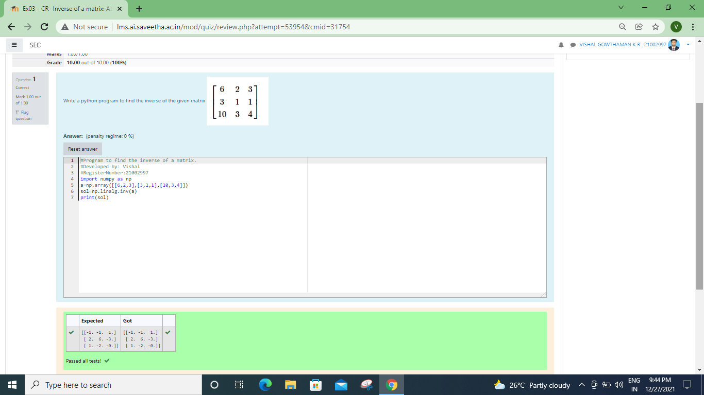

# INVERSE-OF-A-MATRIX
## Aim:
To write a python program to find the inverse of a matrix
## Equipment’s required:
1. 	Hardware – PCs
2. 	Anaconda – Python 3.7 Installation / Moodle-Code Runner
## Algorithm:
### Step1 : Import numpy as np to find the inverse of a matrix.
### Step 2: Get the input from the user as A to find the inverse of a matrix.
### Step 3: Using the np.linalg.inv(A),the inverse of a matrix is found.
### Step 4: Print the values and End the Program.

## Program:
```
import numpy as np
A=([[1,0,3],[-1,2,-2],[2,3,-1]])
b=np.linalg.inv(A)
print(b)
```
## Output:

## Result:
Thus the inverse of given matrix is successfully solved using python program

